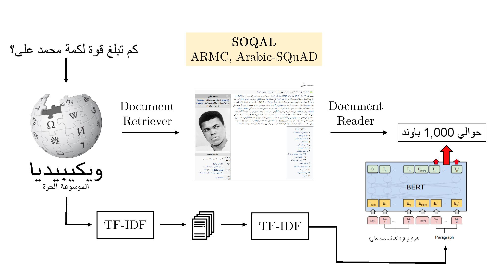

# SOQAL: Neural Arabic Question Answering
(Under construction)
This repository includes the code and dataset described in our WANLP 2019 paper Neural Arabic Question Answering by Hussein Mozananr, Karl El Hajal, Elie Maamary and Hazem Hajj.

**Coming soon:**
*  Trained models and retriever
*  Jupyter notebook tutorial for training a simple neural reading comprehension model on the Arabic Reading Comprehension Dataset (ARCD)
*  Google Colab for training BERT on Arabic-SQuAD and ARCD

Quick Links:
*  [Datasets](data/README.md)
*  [BERT](bert/README.md)
*  [Document Retrievers](retriever/README.md)
*  [Getting Arabic Wikipedia](arwiki/README.md)
*  [Tools for Creating our datasets](dataset_creation/README.md)
## Arabic Open Domain Question Answering

This work builds a system for open domain
factual Arabic question answering (QA) using
Wikipedia as our knowledge source. This
constrains the answer of any question to be a
span of text in Wikipedia. However, this enables to use neural reading comprehension models for our end goal.
 
Open domain QA
for Arabic entails three challenges: annotated
QA datasets in Arabic, large scale efficient information
retrieval and machine reading comprehension.
To deal with the lack of Arabic
QA datasets we present the Arabic Reading
Comprehension Dataset (ARCD) composed of
1,395 questions posed by crowdworkers on
Wikipedia articles, and a machine translation
of the Stanford Question Answering Dataset
(Arabic-SQuAD) containing 48,344 questions.

Our system for open domain
question answering in Arabic (SOQAL)
is based on three components: (1) a document
retriever using a hierarchical TF-IDF approach, (2) a neural reading comprehension
model using the pre-trained bi-directional
transformer BERT and finally (3) a linear answer ranking module to obtain .

Credit: This work draws inspiration from [DrQA](https://github.com/facebookresearch/DrQA). 

## Platform
Tested for Python 3.6 on Windows 8 and 10.

## Installing SOQAL
Create a new virtual environment (you need to install virtualenv if you want) and activate it:
```shell
virtualenv venv
venv\Scripts\activate
```
Now you are in the virtual environment you have created and will install things here.


Run the following commands to clone the repository and install SOQAL:
```shell
git clone https://github.com/husseinmozannar/SOQAL.git
cd SOQAL
pip install -r requirements.txt
```


## Demo
(We will soon provide trained models, this relies on you training BERT and building the retriever)

To interactively ask Arabic open-domain questions to SOQAL, follow the instructions bellow: 

```shell
python demo_open.py ^
-c bert/multilingual_L-12_H-768_A-12/bert_config.json ^
-v bert/multilingual_L-12_H-768_A-12/vocab.txt ^
-o bert/runs/ ^
-r retriever/tfidfretriever.p
```

And on your browser go to:
```
localhost:9999
```
## Citation

(pending ACL release)

Please cite our paper if you use our datasets or code:

```
@inproceedings{mozannar2019soqal,
  title={Neural Arabic Question Answering},
  author={Mozannar, Hussein and El Hajal, Karl and Maamary, Elie and Hajj, Hazem},
  booktitle={Association for Computational Linguistics (ACL)},
  year={2019}
}